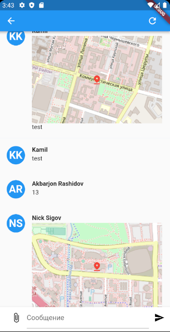
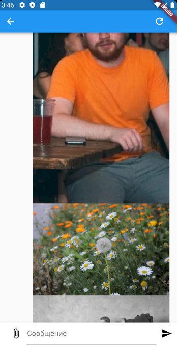
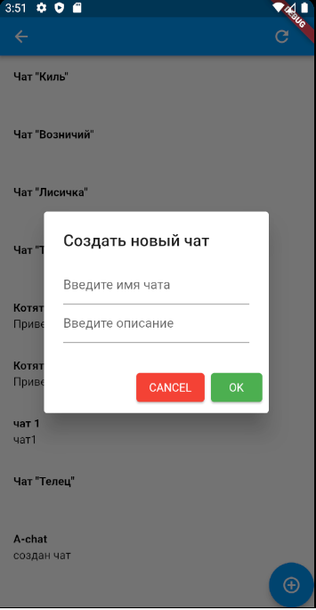

# Целевая платформа

[здесь вставьте платформу/платформы под которые вы разрабатывали, это поможет нам при проверке заданий]
Плотформа Adroid

# Результаты

[здесь можете похвастаться, что успели реализовать, или сделали что-то сверх задания, или добавили свой Payload]

Реализовано:
- пользовательский интерфейс экрана авторизации;
- логика авторизации, с сохранением полученного токена в хранилище shared_preferences;
- отображение SnackBar при ошибке при авторизации;
- отображение сообщений, включающих в себя геолокацию, с маркеров на миникарте в чате;

- отображение изображений в сообщении с фоновой подгрузкой;

- пользовательский интерфейс для экрана топиков, а также создание новых;

[здесь оставьте ссылки на скринкаст/скриншоты, можно в Github-репозитории или в отдельном обалке]
